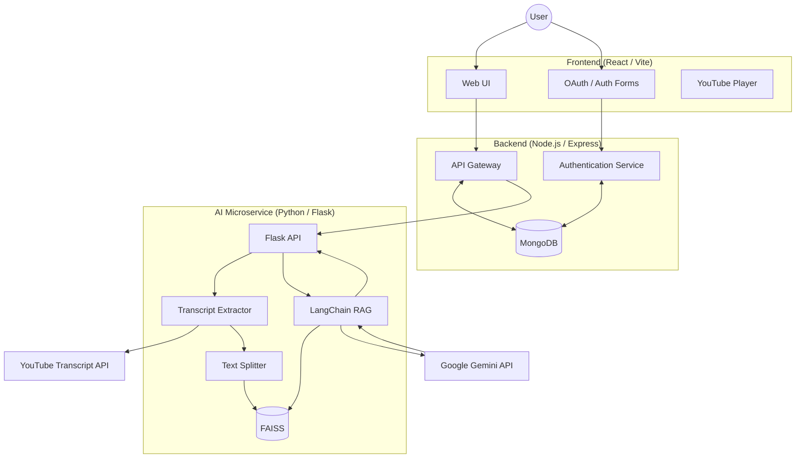

# 📹 YTVideoSummarizer


## 🚀 Overview

**YTVideoSummarizer** is an AI-powered learning platform that transforms lengthy YouTube videos into concise summaries, structured chapters, and interactive conversations. It combines a MERN stack application with a Python Flask microservice powered by LangChain, FAISS, and Google Gemini to provide an intelligent video-learning experience.

---

## ✨ Features

* 📝 AI-generated summaries from YouTube videos
* 💬 Retrieval-Augmented Generation (RAG) chat with video transcripts
* ⏱️ Automatic chapter generation with timestamps
* 📓 Rich-text note taking using TipTap
* 🔍 Semantic transcript search using FAISS
* 🔐 JWT Authentication
* 🌐 Google OAuth 2.0 Login

---

# 🏗️ Architecture



---

# 🛠️ Tech Stack

## Frontend

* React (Vite)
* JavaScript
* Tailwind CSS
* Shadcn UI
* GSAP
* React YouTube

## Backend

* Node.js
* Express.js
* MongoDB
* Mongoose
* JWT Authentication
* Google OAuth 2.0

## AI Microservice

* Python
* Flask
* LangChain
* Google Gemini
* FAISS
* YouTube Transcript API

---

# ⚙️ Local Setup

## Prerequisites

* Node.js 18+
* Python **3.11** (Recommended)
* MongoDB Atlas
* Google Cloud OAuth Credentials
* Gemini API Key

> **Note:** This project currently uses LangChain 0.2.x and is recommended to run with **Python 3.11** for compatibility.

---

## Clone Repository

```bash
git clone https://github.com/your-username/ytvideosummarizer.git
cd yousummarizer
```

---

## Environment Variables

### frontend/.env

```env
VITE_BACKEND_URI=http://localhost:5000
```

### backend/.env

```env
PORT=5000

MONGO_URI=your_mongodb_connection_string

ACCESS_TOKEN_SECRET=your_jwt_secret

FLASK_URI=http://localhost:8080

GOOGLE_CLIENT_ID=your_google_client_id

GOOGLE_CLIENT_SECRET=your_google_client_secret
```

### services/.env

```env
GOOGLE_API_KEY=your_gemini_api_key
```

---

# ▶️ Running the Project

Open **three separate terminals**.

## Terminal 1 — Backend

```bash
cd backend
npm install
npm run dev
```

Runs on:

```
http://localhost:5000
```

---

## Terminal 2 — AI Microservice

```bash
cd services

python -m venv venv

# Windows
.\venv\Scripts\Activate.ps1

# macOS/Linux
source venv/bin/activate

pip install -r requirements.txt

python app.py
```

Runs on:

```
http://localhost:8080
```

---

## Terminal 3 — Frontend

```bash
cd frontend

npm install

npm run dev
```

Runs on:

```
http://localhost:5173
```

---

# 📂 Project Structure

```
YTVideoSummarizer/
│
├── frontend/
│
├── backend/
│
├── services/
│
└── README.md
```

---

# 🤝 Contributing

Contributions are welcome.

1. Fork the repository
2. Create a feature branch
3. Commit your changes
4. Open a Pull Request

---

# 📄 License

This project is licensed under the MIT License.
